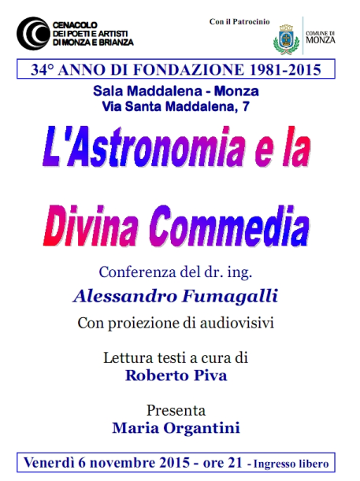
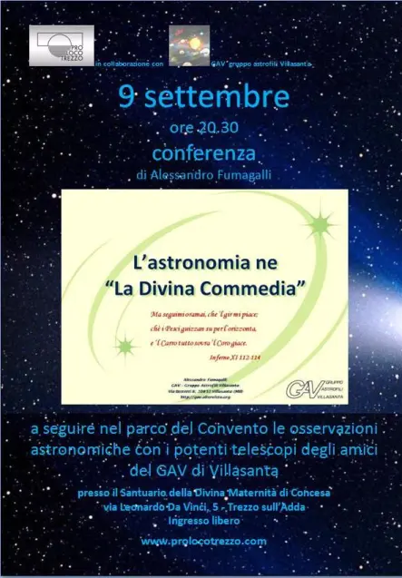



<h1>Dante e l'astronomia</h1>

erché parlare di Dante in un corso di astronomia?

Dante era un uomo molto colto per l’epoca in cui visse: aveva studiato le arti liberali del trivio e del quadrivio (e quindi anche l’astronomia) e questo ci consente di ricostruire la visione cosmologica dell’uomo medioevale che, seppur con i propri limiti, metteva in luce alcuni aspetti e problemi ben noti all’epoca (come il problema del calendario giuliano) ed ha conentito agli studiosi contemporanei di far luce su falsi preconcetti che molti di noi hanno sui Secoli Bui (la sfericità’ della Terra e’ un concetto ben noto per l’uomo del Medioevo).\
Sebbene Dante rimanga un uomo dalla visione geocentrica dell’Universo, “La Divina Commedia” considerata come un’opera che parla della salvezza dell’Uomo, ci sono moltissimi riferimenti al cielo (per alcuni storici ci sono più di centinaia riferimenti astronomici).\
La conferenza si pone come obiettivo di illustrare una selezione di essi, catalogati per tipologia tramite il commento di alcuni passi selezionati dalle tre Cantiche: in particolare: la geografia terrestre, la precessione degli equinozi, la longitudine, l’eclittica, il cielo australe, la misura del tempo, il calendario giuliano ed il modello tolemaico.\
Dante era un uomo molto colto per l’epoca in cui visse: aveva studiato le arti liberali del trivio e del quadrivio (e quindi anche l’astronomia) e questo ci consente di ricostruire la visione cosmologica dell’uomo medioevale che, seppur con i propri limiti, metteva in luce alcuni aspetti e problemi ben noti all’epoca (come il problema del calendario giuliano) ed ha consentito agli studiosi contemporanei di far luce su falsi preconcetti che molti di noi hanno sui Secoli Bui (la sfericità’ della Terra e’ un concetto ben noto per l’uomo del Medioevo).\
Sebbene Dante rimanga un uomo dalla visione geocentrica dell’Universo, _La Divina Commedia_ considerata come un’opera che parla della salvezza dell’Uomo, ci sono moltissimi riferimenti al cielo (per alcuni storici ci sono più di centinaia riferimenti astronomici).\
La conferenza si pone come obiettivo di illustrare una selezione di essi, catalogati per tipologia tramite il commento di alcuni passi selezionati dalle tre Cantiche: in particolare: la geografia terrestre, la precessione degli equinozi, la longitudine, l’eclittica, il cielo australe, la misura del tempo, il calendario giuliano ed il modello tolemaico.

---

::: {style="display: grid; grid-template-columns: repeat(2, 1fr); gap: 10px;"}

::: {}

{fig-align="center" width=65% .lightbox}

Locandina della conferenza patricinata dal Comune di Monza.
:::

::: {}

{fig-align="center" width=65% .lightbox}

Locandina della conferenza tenuta a Trezzo sull'Adda. Al termine della conferenza è seguita la serata osservativa nel chiostro del convento.
:::

:::

---

