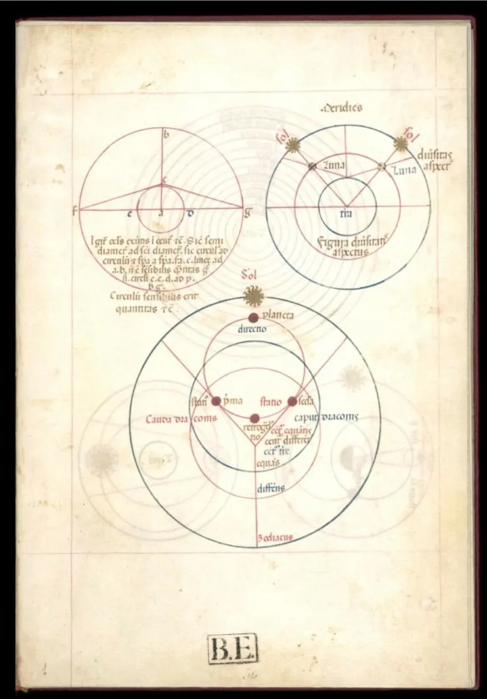
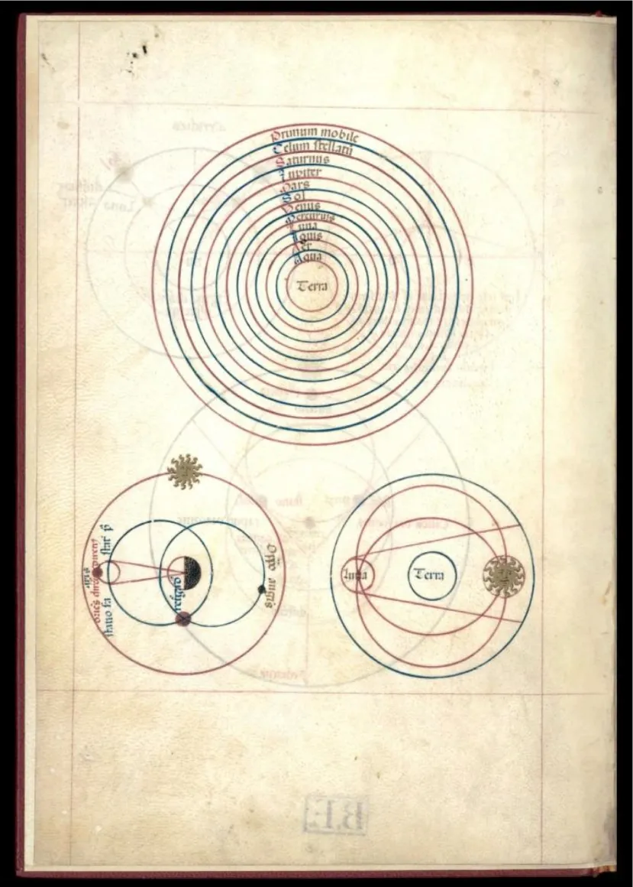
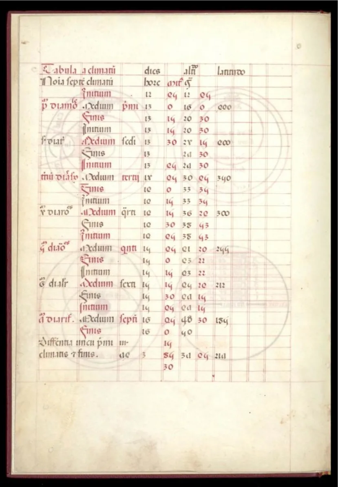
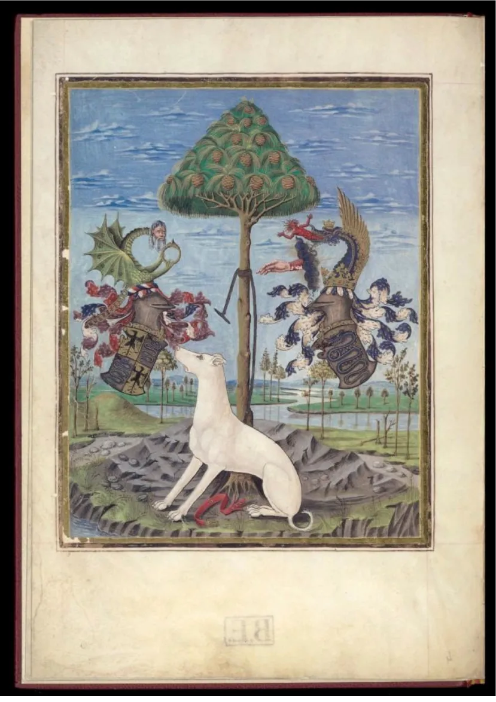
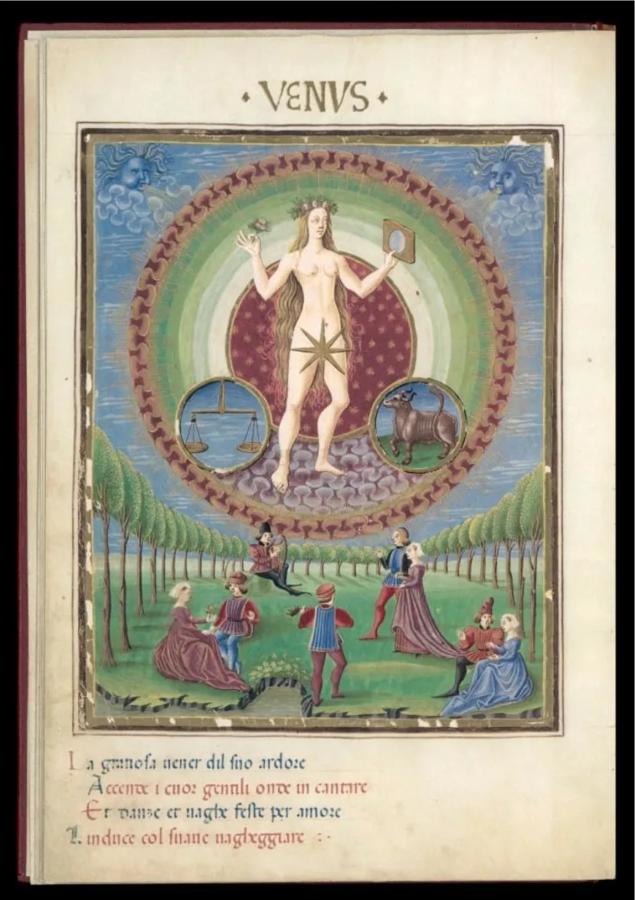
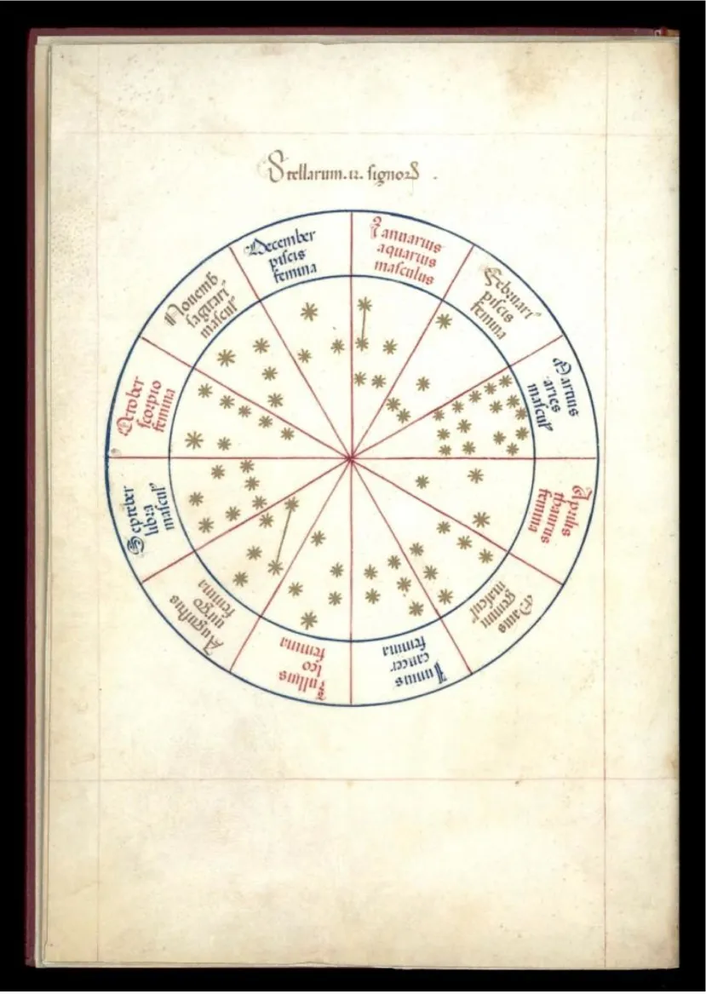

::: {.epigraph}
"La Terra è situata al centro del mondo, immobile, e attorno a essa ruotano le sfere celesti con ordine immutabile"
Giovanni di Sacrobosco (1195-1256)  Trattato della Sfera
:::

<h1><i>De Sphaera</i> e il mondo medioevale</h1>

::: {.drop-cap}
Il _Sphaerae coelestis et planetarum descriptio_, chiamato anche semplicemente _De Sphaera estense_, è un trattato di astrologia-astronomia, decorato su pergamena datato attorno al 1470 presumibilmente da Cristoforo de Predis, un miniaturista milanese. Dal punto di vista filologico l'opera è un codice membranaceo (formato di fogli di pergamena), anepigrafo (senza titolo.) e adespoto (senza nome dell'autore) che consta di un unico fascicolo di otto fogli, sedici carte numerate con riquadri ortogonali in rosso e rigatura all'inchiostro; la scrittura è semigotica libraria in rosso seppia e azzurro nei disegni astrologici e in rosso e azzurro nei distici al piede delle tavole.
:::
La presenza in quarta pagina di stemmi sforzeschi fa pensare che l'opera fosse stata commissionata per la corte sforzesca di Milano, quindi vent'anni dopo il manoscritto giunse alla corte degli Estensi a Ferrara come dono di nozze da parte di Galeazzo Sforza alla figlia Anna Maria in occasione del suo matrimonio con Alfonso I d'Este.\
Il trattato è composto da una serie di illustrazioni miniate e disegni astronomici accompagnati da brevi descrizioni in latino medievale; le pagini centrali sono dedicate alla parte astrologica dell'opera e dipingono una rappresentazione allegorica dei pianeti con la loro – possibile – influenza sulla vita degli uomini arricchite con versi poetici a tema. \
Il contesto storico in cui si colloca il _De Sphaera estense_ è l'inizio del Rinascimento; un periodo in cui era ancora ben radicata la dottrina Tolemaica e Aristotelica. Negli anni in cui fu composto il trattato, la concezione geocentrica dell'Universo rappresentava ancora la cosmologia più accreditata negli ambienti europei: le orbite dei pianeti, posti a una distanza progressiva dalla Terra, erano descritte da un complesso sistema di epicicli-deferenti utili a giustificare le osservazioni sperimentali. L'opera trae molta ispirazione dal _De Sphaera Mundi_, un trattato astronomico di Giovanni Sacrobosco del 1230 che ebbe molta diffusione in Europa nel Medioevo, con particolare riguardo le tavole che affermano la sfericità della Terra, le orbite, il moto dei pianeti e la concezione tolemaica e geocentrica dell'Universo. Per quanto riguarda il contenuto all'aspetto della Luna e alla teoria degli epicicli-deferenti, l'opera fa riferimento ai lavori di Georg Peuerbach (astronomo e matematico austriaco del XV secolo) in particolare all'opera _Theorica nova planetarum_.

---

Il testo del trattato è distribuito in 25 tavole dal carattere artistico, scientifico e poetico il cui contenuto è qui di seguito brevemente descritto:

::: {.grid}

::: {.g-col-12 .g-col-sm-6 .g-col-md-3}
**Tavola I**

* Teoria dei campi di visibilità della sfera terrestre e celeste: orizzonte visibile (circulus sensibilis) e grandezza della Terra.
* Teoria della diversità dell'aspetto della Luna rispetto al Sole (_diversitas aspectus lunae a solem_).
* Circolo dei pianeti e loro movimento (moto progrado e retrogrado)

{fig-align="center" width=650% .lightbox}
:::

<!--::: {}-->
::: {.g-col-12 .g-col-sm-6 .g-col-md-3}
**Tavola II**

* Forma dell'Universo e divisione della sfera celeste in tredici elementi concentrici (terra, acqua, aria e fuoco) unitamente ai sette pianeti conosciuti.
* Il moto dei pianeti: moto solare, lunare ed orbite.
* Teoria dei nodi lunari e delle fasi lunari.

{fig-align="center" width=650% .lightbox}
:::

::: {.g-col-12 .g-col-sm-6 .g-col-md-3}
**Tavola III**

* Movimento dell'acqua (_orbis aquae_) in connessione col movimento solare.
* Teoria geocentrica e dimostrazione mediante il principio della piccolezza della Terra rispetto al firmamento.
* Teoria della variazione apparente della grandezza dei pianeti in rapporto alla loro posizione.
:::

::: {.g-col-12 .g-col-sm-6 .g-col-md-3}
**Tavola IV**

* Eclissi lunari e orari di visibilità per le longitudini di Roma e Parigi.
:::

:::

::: {style="display: grid; grid-template-columns: repeat(4, 1fr); gap: 10px;"}

::: {.g-col-12 .g-col-sm-6 .g-col-md-3}
**Tavola V**

Eclissi di Sole e Luna.
Tavola dei climi dell'emisfero settentrionale tra la zona torrida e il polus articus.
Teoria del moto di Saturno, Giove e Marte.
:::

::: {.g-col-12 .g-col-sm-6 .g-col-md-3}
**Tavola VI**

Coordinate dei climi.

{fig-align="center" width=650% .lightbox}
:::

::: {.g-col-12 .g-col-sm-6 .g-col-md-3}
**Tavola VII**

Araldica: disegni che richiamano chiaramente topografia e pianura lombarda. L'inserimento nel quadro d'insieme di animali e piante conferiscono alla tavola anche un significato allegorico.

{fig-align="center" width=650% .lightbox}
:::

::: {.g-col-12 .g-col-sm-6 .g-col-md-3}
**Tavola VIII – IX**

Rappresentazione del pianeta Saturno tramite figure allegoriche.
:::

::: {.g-col-12 .g-col-sm-6 .g-col-md-3}
**Tavola X – XI**

Rappresentazione del pianete Giove tramite figure allegoriche.
:::

::: {.g-col-12 .g-col-sm-6 .g-col-md-3}
**Tavola XII – XIII**

Rappresentazione del pianeta Marte tramite figure allegoriche.
:::

::: {.g-col-12 .g-col-sm-6 .g-col-md-3}
**Tavola XIV – XV**

Rappresentazione del Sole tramite figure allegoriche.
:::

::: {.g-col-12 .g-col-sm-6 .g-col-md-3}
**Tavola XVI – XVII**

Rappresentazione del pianeta Venere tramite figure allegoriche.
:::

::: {.g-col-12 .g-col-sm-6 .g-col-md-3}
**Tavola XVIII – XIX**

Rappresentazione del pianeta Mercurio tramite figure allegoriche.
:::

::: {.g-col-12 .g-col-sm-6 .g-col-md-3}
**Tavola XX – XXI**

Rappresentazione della Luna tramite figure allegoriche.

{fig-align="center" width=650% .lightbox}
:::

::: {.g-col-12 .g-col-sm-6 .g-col-md-3}
**Tavola XXII**

Rappresentazione dello Zodiaco con le costellazioni durante l'anno.

{fig-align="center" width=650% .lightbox}
:::

::: {.g-col-12 .g-col-sm-6 .g-col-md-3}
**Tavola XXIII**

I quattro elementi e loro proprietà.
:::

::: {.g-col-12 .g-col-sm-6 .g-col-md-3}
**Tavola XXIV**

* I quattro elementi in relazione alle quattro stagioni e le quattro età dell'uomo.
* Schema delle fasi lunari con descrizione delle parti illuminate nel periodo dal novilunio al plenilunio.
:::

::: {.g-col-12 .g-col-sm-6 .g-col-md-3}
**Tavola XXV**

* Teorie degli equinozi, solstizi, distribuzione e durata del giorno e della notte.
:::

:::

Il _De Sphaerae Coelestis et Planetarium_ è considerato il più bel libro illustrato risalente al Rinascimento e uno degli ultimi documenti astronomici-astrologici scritti prima della grande rivoluzione galileiana che separò definitivamente la scienza dalla credenza.
L'opera è conservata presso la Biblioteca Estense di Modena; in alternativa è possibile sfogliarlo online [QUI](http://bibliotecaestense.beniculturali.it/info/img/mss/i-mo-beu-alfa.x.2.14.pdf){target="_blank" rel="noopener noreferrer"}

<h3>Bibliografia</h3>

Il _De Sphaera estense_, Pietro Puliatti – Poligrafiche Bolis Bergamo 1969
Significato dei termini filologici: Enciclopedia Treccani on-line.

---

