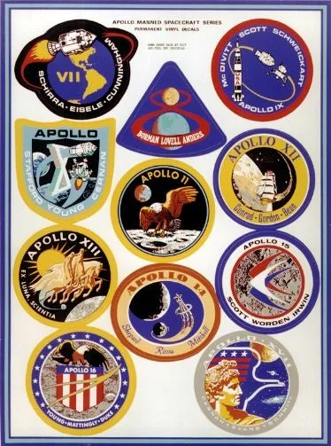
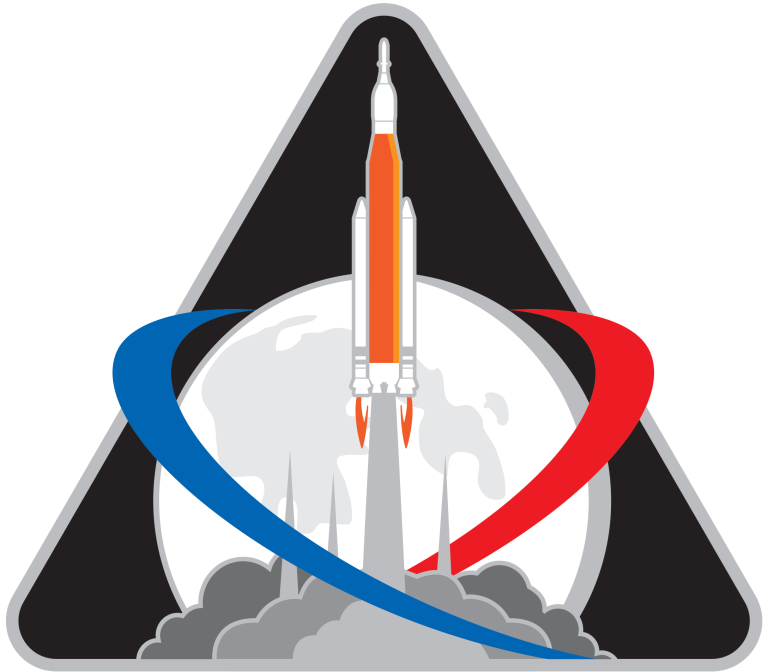
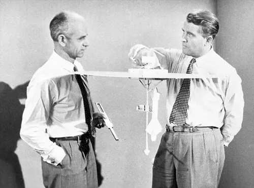



<h1>Perché la Luna</h1>

Il programma Artemis è in pieno svolgimento: le missioni Artemis 1 e Artemis 2 sono state completate con successo: sebbene in un contesto e scopi diversi degli anni ’60 si tratta comunque di un passo importante per il ritorno sul nostro satellite naturale: questa volta con la collaborazione di altre agenzie spaziali e di privati.

  <figure style="text-align: center;">
    
    <figcaption>
      <a href="https://apollo11space.com/all-apollo-mission-patches" target="_blank" rel="noopener noreferrer">Patch Apollo</a>
    </figcaption>
  </figure>
  <figure style="text-align: center;">
    
    <figcaption>
      <a href="https://www.nasa.gov/feature/artemis-i-identifier" target="_blank" rel="noopener noreferrer">Patch Artemis 1</a>
    </figcaption>
  </figure>

Per chi ancora si chiedesse perché investire nell'esplorazione spaziale, perché andare sulla Luna o pensare di pianificare una missione umana su Marte trovate un’eccellente e straordinaria risposta [QUI](https://lettersofnote.com/2012/08/06/why-explore-space){target="_blank" rel="noopener noreferrer"}
La lettera venne scritta da Ernst Stuhlinger, uno scienziato tedesco (si signori, tedesco) che al termine della Seconda Guerra Mondiale venne trasferito ad Huntsville dagli alleati durante l’Operazione Paperclip (insieme ad un centinaio di altri scienziati tra cui Von Braun).

Negli anni ’60 infatti una suora dello Zambia (Mary Jucunda) scrisse alla NASA chiedendo perché spendere soldi per lo spazio quando sulla Terra molte persone muoiono di fame o vivono in condizioni pessime. La risposta di Ernst è stata semplicemente eccezionale e si riassume nella prima parte della lettera (prime 20 righe circa) e con un fantastico esempio nel passo successivo quando narra la storia di un Conte Tedesco.

<figure style="text-align: center;">
  
    <figcaption>
      <a href="http://www.collectspace.com/ubb/Forum38/HTML/000849.html" target="_blank" rel="noopener noreferrer">Ernst Stuhlinger e Wernher von Braun</a>
    </figcaption>  
</figure>

Oggi la fame del mondo c’è ancora e, nonostante la pandemia, il problema non è così grave come 60 anni fa, ma ci sono altre sfide: crisi energetica, Riscaldamento Globale ... e purtroppo esistono ANCORA gruppi che si pongono le stesse domande cercando di manipolare o strumentalizzare l’opinione pubblica trovando pure un seguito fra le persone che NON conoscono cosa vuol dire scienza o fare ricerca e sviluppo (R*&*D) (perché non hanno mai passato un giorno in un laboratorio di un centro di ricerca o in un ufficio tecnico).

A questo gruppo di persone (_populisti_), un termine che risale alla Guerra Fredda e riciclato oggi impropriamente (chissà perché o come mai) in un contesto diverso con un significato diverso è dedicata ancora la stessa risposta di Ernst. Bisogna pensare prima di parlare per non manipolare la mente delle persone.

<b>La Luna è una tappa fondamentale per il grande salto: conoscerla e studiarla ne vale sempre la pena. Ricordatevi: se abitiamo questo Pianeta lo dobbiamo anche a Lei.<b>

::: {.callout-note}
PS: fare R*&*D significa trovare risposte a domande che ancora non conosciamo e che mettiamo in un recipiente. Un domani (inteso anche tra una generazione) potremmo trovare ad affrontare domande su problemi che ancora non sappiamo esistono ma noi, cercando nel cesto, abbiamo già le risposte. Tutto ciò costa un investimento iniziale (e continuo nel tempo) ma questo ci rende preparati ai problemi di domani.

Nel caso delle missioni Apollo ricordateVi che ogni dollaro speso, ne ha generati circa sette di ritorno e delle innovazioni che sono nate ne ha beneficiato TUTTA l’Umanità.
:::

---

