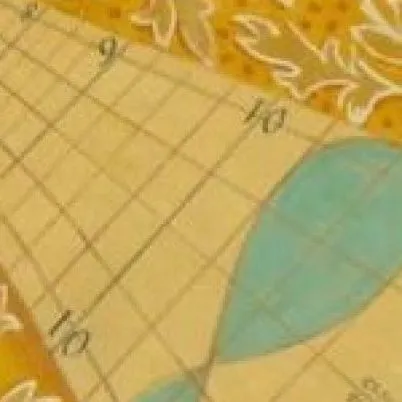

<!-- begin sup -->

::: {.sezione-superiore}

::: {.grid .text-center}
::: {.g-col-4  .p-2 .align-items-center style="background-color: #ffffff; color: #3182ce;"}
<h2>Benvenuti</h2>
Se siete appassionati di astonomia ed astronautica siete sul sito giusto: qui potete trovare curiosità, storia e personaggi che hanno contribuito a questa antica scienza. </br> Questo non e' un blog ne'  rappresenta una testata giornalistica in quanto viene aggiornato senza alcuna periodicità: non può pertanto considerarsi un prodotto editoriale ai sensi della legge n° 62 del 7.03.2001. 

::: {.grid .text-center}
::: {.g-col-6}
[ Privacy ](/privacy.qmd){.btn .btn-custom role="button"}
:::

::: {.g-col-6}
 [ Cookie ](/cookies.qmd){.btn .btn-custom role="button"}
:::
:::

:::

::: {.g-col-8 .p-2}

:::: {.carousel controls="false" indicators="false" duration=1500} 
:::: {.carousel-item image="https://picsum.photos/800/400?random=1" style="height: 400px;"} 
:::
:::: {.carousel-item image="https://picsum.photos/800/400?random=2" style="height: 400px;"} 
:::
:::: {.carousel-item image="https://picsum.photos/800/400?random=3" style="height: 400px;"} 
:::
:::

:::
:::

:::
<!-- end sup -->

---

```{=html}
<section class="container author-box-full">
    <div class="author-box">
        <div class="author-image-container">
            
        </div>
        <div class="author-bio">
            <h3>Informazioni sull'Autore</h3>
            <p>Laureato in ingegneria ed appassionato di astronomia e astronautica dai tempi del Grand Tour delle sonde Voyager. Socio e conferenziere del GAV (Gruppo Astrofili di Villasanta). Progettista software/firmware con esperienza pluridecennale di progettazione e sviluppo algoritmi statistici e di analisi dei dati.</br> Possiede una consolidata esperienza in metodologie Agile (Scrum) ed abbraccia la cultura DevOps per lo sviluppo e rilascio di prodotti IT di alta qualita’.</br>E' certificato  PMI–CAPM® e PMI–CPMAI®.
            </p>
        </div>
    </div>
</section>
```

---

<!-- begin inf -->
::: {.sezione-inferiore}

::: {.grid .text-center}
::: {.g-col-4  .p-2 .align-items-center style="background-color: #ffffff; color: #3182ce;"}
<h2>Il cielo adesso</h2>
<p>Stai programmando una serata osservativa? Meglio conoscere in anticipo
il meteo per il luogo di osservazione. Scegli la localita' e vedi quali oggetti
celesti puoi vedere in cielo.</p>
[Guarda il cielo](index.qmd){.btn .btn-custom role="button"}
:::

::: {.g-col-4  .p-2 style="background-color: #ffffff; color: #3182ce;"}
<h2>Il libro</h2>
<p>In anteprima la bozza del libro "Il cielo per tutti: piccolo zibaldone  di astronomia ed astronautica"</p>
[Guarda l'anteprima](index.qmd){.btn .btn-custom role="button"}
:::

::: {.g-col-4  .p-2 style="background-color: #ffffff; color: #3182ce;"}
<!-- .p-2 padding -->
<h2>Portfolio conferenze</h2>
<p>Le conferenze, corsi e caffe' astronomici dell'autore per la cittadinanza.</p>
[Guarda i progetti](index.qmd){.btn .btn-custom role="button"}
:::

:::

:::
<!-- end inf -->

---

