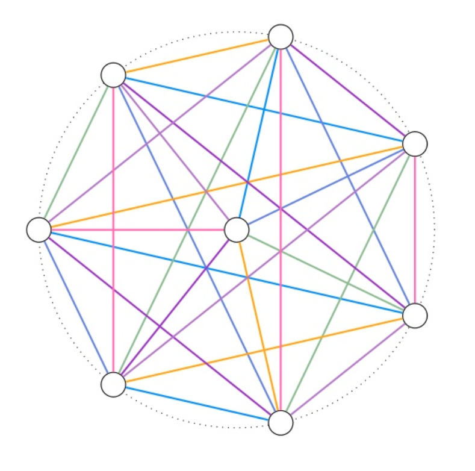

::: {layout="[0.80, 0.20]"}
<div>
```{=html}
        <div class="swiper">
            <div class="swiper-wrapper">
                <div class="swiper-slide"></div>
                <div class="swiper-slide"></div>
                <div class="swiper-slide"></div>
            </div>
            <!-- Paginazione e Frecce -->
            <div class="swiper-pagination"></div>
            <div class="swiper-button-prev"></div>
            <div class="swiper-button-next"></div>
        </div>
        
        <!-- Inizializzazione -->
        <script>
            const swiper = new Swiper('.swiper', {
                loop: true,
                autoplay: { delay: 3000 },
                pagination: { el: '.swiper-pagination', clickable: true },
                navigation: { nextEl: '.swiper-button-next', prevEl: '.swiper-button-prev' },
            });
        </script>
```
</div>
<div>
<h3>Servizi 1</h3>
Contenuto della seconda colonna laterale (occupa circa 1/3 della pagina).
</div>
:::

::: {layout="[0.80, 0.20]"}

<div>
::: {.columns}

::: {.column width="32%"}
::: {style="background-color: #f0e4cc; padding: 10px; border-radius: 8px; border: 1px solid #eee;"}
<h2>Servizi</h2>
Questo è il contenuto del primo paragrafo. Qui puoi inserire informazioni relative al primo argomento, dettagli introduttivi o descrizioni di servizi.
:::
:::

::: {.column width="2%"}
<!-- Spaziatore tra le colonne -->
:::

::: {.column width="32%"}
::: {style="background-color: #f0e4cc; padding: 10px; border-radius: 8px; border: 1px solid #eee;"}
<h2>Servizi</h2>
Questo è il contenuto del secondo paragrafo. In questa sezione centrale puoi trattare un altro aspetto, condividere aggiornamenti o mostrare notizie recenti.
:::
:::

::: {.column width="2%"}
<!-- Spaziatore tra le colonne -->
:::

::: {.column width="32%"}
::: {style="background-color: #f0e4cc; padding: 10px; border-radius: 8px; border: 1px solid #eee;"}
<h2>Servizi</h2>
Questo è il contenuto del terzo paragrafo. Qui puoi inserire risorse, contatti o qualsiasi altra informazione utile per completare la pagina.
:::
:::

:::
</div>

<div>
<h3>Servizi</h3>
Contenuto della seconda colonna laterale (occupa circa 1/3 della pagina).
</div>
:::

---

```{=html}
    <section class="container author-box-full">
        <div class="author-box">
            <div class="author-image-container">
                
            </div>
            <div class="author-bio">
                <h3>Informazioni sull'Autore</h3>
                <p>Ciao! Sono un appassionato di sviluppo web e design. In questo box puoi inserire la tua biografia, raccontare la tua storia e condividere i tuoi interessi. Questo layout ti permette di presentarti in modo professionale.</p>
            </div>
        </div>
        <div>
        </div>
        <div align="center">
            © 2026 Il Tuo Sito Web. Creato con <a href="[https://quarto.org](https://quarto.org)" target="_blank">Quarto</a>.
        </div>
        <div>
        </div>
        <div align="center">
            <a href="#privacy">Privacy Policy</a> &nbsp;|&nbsp; 
            <a href="#terms">Termini di Servizio</a> &nbsp;|&nbsp; 
            <a href="#contatti">Contatti</a>
        </div>
  </section>  
```  


